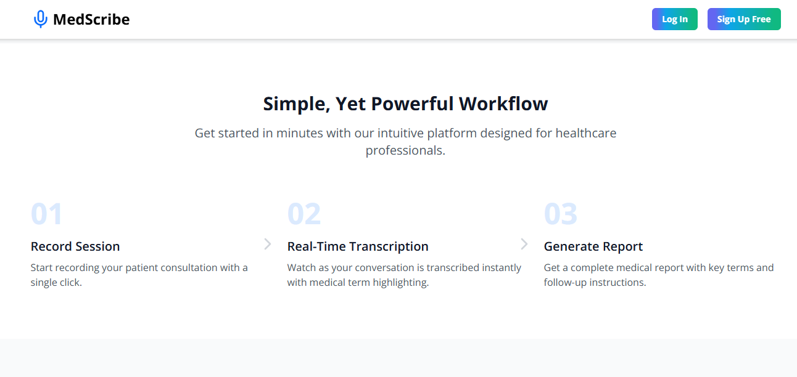

# MedScribe: AI-Powered Medical Transcription and Report Generation Assistant

MedScribe is an intelligent web application designed to automate the process of medical transcription and generate structured, professional-grade medical reports. The platform utilizes **Speech-to-Text**, **Natural Language Processing (NLP)**, and **GenAI** to enhance clinical productivity, improve patient documentation accuracy, and reduce administrative costs in the healthcare domain.


## Features

- 🎙️ Real-time transcription using Speech Recognition API

- 🧠 NLP-powered medical terms extraction like Personal Health information (PHI), Symptoms, Diagnosis and Follow-up.

- 📝 Live editing and custom medical report generation with GenAI

- 📁 Session history with date, time, transcript, and summary

- 🧾 Customizable report templates based on medical specialties

- 🔐 2FA authentication for doctors with secure session storage

- 🤖 Chatbot and Telehealth support for integrated digital care

## Tech Stack


### Frontend:
- ⚛️ React (TypeScript)
- 💨 Tailwind CSS
- 🎨 Material UI

### Backend & AI:
- 🧠 NLP (NLTK, Scikit-learn, Random Forest, Bag of Words)
- 📊 ML model trained on Kaggle dataset of 4998 medical transcripts
- 🤖 GenAI for medical report generation

### Audio & Speech:
- 🔊 Speech Recognition API (JavaScript) and AWS Comprehend Medical

### Hosting & Deployment:
- ☁️ AWS/Vercel for deployment

## Installation

### Prerequisites:
- Node.js & npm
- Git
- AWS SDK

### Steps:
```bash
# Clone the repository
git clone https://github.com/SagarG2003/Medscribe.git
cd Medscribe

# Install dependencies
npm install

# Start the development server
npm run dev

```
## Screenshots

### Landing Page




### Doctor's Dashboard


## Badges

[](https://choosealicense.com/licenses/mit/)
[](https://opensource.org/licenses/)
[](http://www.gnu.org/licenses/agpl-3.0)


## Contact

Email: sagarguney@gmail.com

LinkedIn: https://www.linkedin.com/in/sagar-guney-877614241/

Portfolio: https://portfolio-website-kappa-nine-48.vercel.app/

